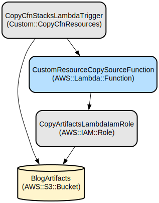

# Architecture Overview

The Amazon Connect Post-Contact Survey Solution uses a serverless architecture built on AWS services. This document provides a comprehensive overview of the system architecture, component interactions, and data flows.

## Architecture Diagram

## System Components

### Amazon Connect Components
- **Contact Flow Module**: Executes the survey flow after a contact ends
- **Amazon Lex Bot**: Processes text responses for chat-based surveys
- **Tasks**: Created automatically for flagged survey responses

### AWS Lambda Functions
- **GetSurveyConfig**: Retrieves survey configuration from DynamoDB
- **WriteSurveyResults**: Stores survey responses in DynamoDB
- **ProcessSurveyFlags**: Evaluates responses against thresholds and creates tasks
- **SurveyUtils**: Provides utility functions for survey flow management
- **SurveyAPI**: Handles API requests for survey management
- **CognitoValidateUser**: Validates user authentication

### Data Storage
- **SurveysConfigDDBTable**: Stores survey configurations
- **SurveysResultsDDBTable**: Stores survey responses

### Frontend Components
- **React Application**: Admin interface for survey management
- **S3 Bucket**: Hosts the static web application
- **CloudFront Distribution**: Delivers the web application

### API and Authentication
- **API Gateway**: Routes API requests to Lambda functions
- **Cognito User Pool**: Manages user authentication

## Data Flow

### Survey Creation Flow
1. Admin authenticates through Cognito
2. Admin creates survey configuration through the web interface
3. API Gateway routes the request to the SurveyAPI Lambda
4. Lambda stores the survey configuration in DynamoDB

### Survey Execution Flow
1. Contact completes in Amazon Connect
2. Contact Flow Module is triggered
3. GetSurveyConfig Lambda retrieves survey configuration
4. Contact Flow presents questions to the customer
5. Customer responses are collected via DTMF (voice) or Lex (chat)
6. WriteSurveyResults Lambda stores responses in DynamoDB
7. ProcessSurveyFlags Lambda evaluates responses against thresholds
8. Tasks are created in Amazon Connect for flagged responses

### Survey Results Flow
1. Admin authenticates through Cognito
2. Admin views survey results through the web interface
3. API Gateway routes the request to the SurveyAPI Lambda
4. Lambda retrieves survey results from DynamoDB

## Security Architecture

### Authentication and Authorization
- **Cognito User Pool**: Manages user authentication for the admin interface
- **IAM Roles**: Control access to AWS resources
- **API Gateway Authorizers**: Validate requests to API endpoints

### Data Protection
- **S3 Bucket Encryption**: Protects static web assets
- **CloudFront Distribution**: Secures content delivery
- **IAM Policies**: Implement least privilege access

## Scalability Considerations

The serverless architecture allows the solution to scale automatically based on demand:

- **Lambda Functions**: Scale automatically with request volume
- **DynamoDB Tables**: Provisioned with appropriate capacity
- **CloudFront Distribution**: Handles global content delivery

## Resilience and Availability

- **Multi-AZ Deployment**: AWS services operate across multiple Availability Zones
- **DynamoDB**: Provides high availability and durability
- **CloudFront**: Ensures global availability of the web application

## Integration Points

- **Amazon Connect**: Integration through Contact Flow Module and Lambda functions
- **API Gateway**: Provides RESTful API endpoints for the web application
- **Cognito**: Handles user authentication and authorization
